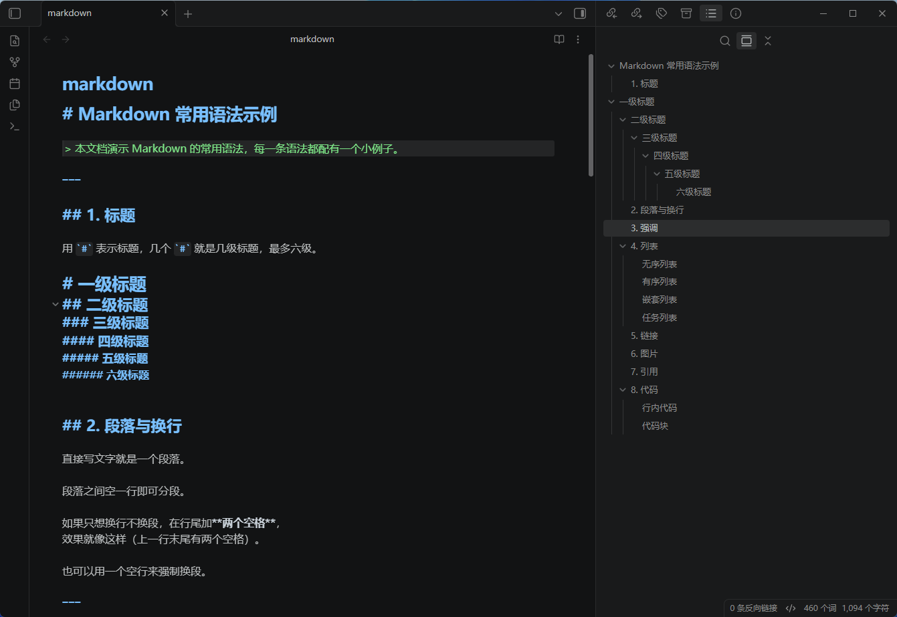
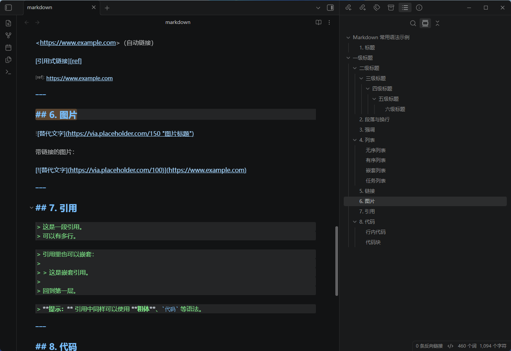
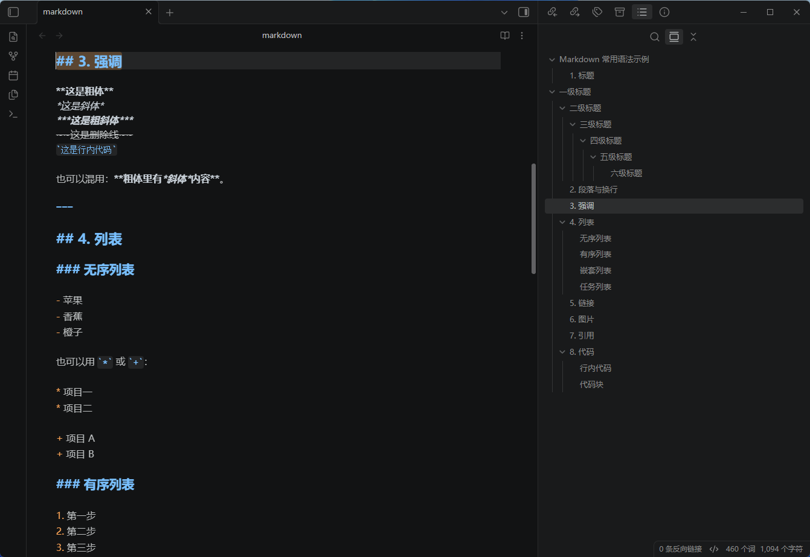
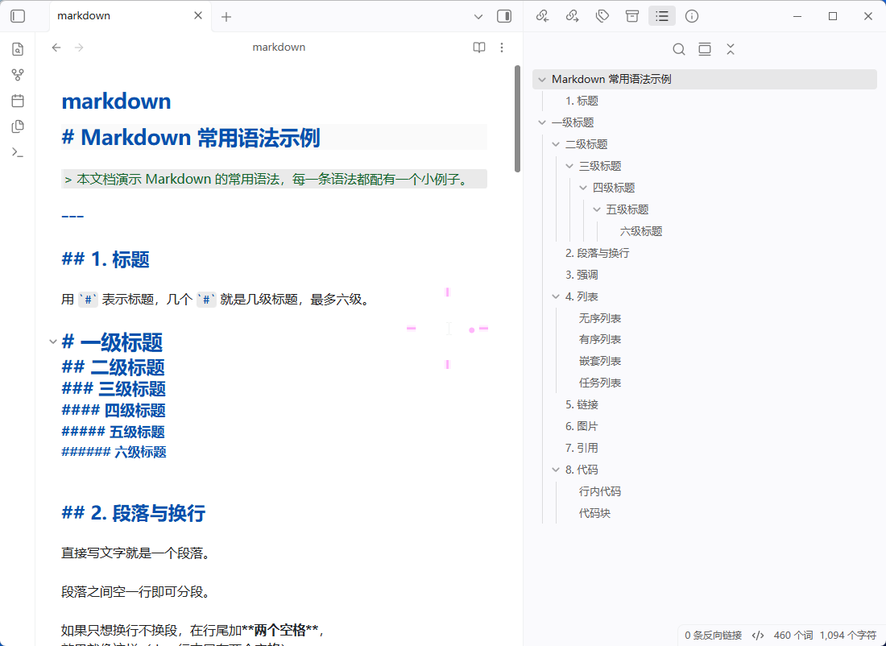

[English](README.md) | [简体中文](README.zh.md)

# VS Code Theme for Obsidian

Ports the official VS Code default color scheme (Dark 2026) into Obsidian, with support for **both dark and light mode**.

---

## 1. Installation

### 1.1 Via Community Themes (recommended; requires marketplace approval)

1. Settings → Appearance → Themes → Manage
2. Search for `VS Code`
3. Install

### 1.2 Manual installation

Copy the `manifest.json` and `theme.css` files from this directory into your vault:

```

<your-vault>/.obsidian/themes/VS Code/

├── manifest.json

└── theme.css

```

> **Note**: The folder name must be `VS Code`, matching the `name` field in `manifest.json`.

> `.obsidian` is a hidden directory. On Windows, you can navigate to it by typing `.obsidian\themes` directly into the File Explorer address bar.

## 2. Enabling the Theme

1. `Settings` → `Appearance`
2. Set `Base theme` to **Dark** or **Light** (this determines which variant is used by default)
3. Select **VS Code** from the `Themes` dropdown

No restart is required. If the theme does not appear, click the refresh button next to the theme dropdown.

---

## 3. Screenshots









---

## 4. License

- This theme is released under the **MIT License**, see [LICENSE](LICENSE). You are free to use, modify, and redistribute it.
- Color data is sourced from [microsoft/vscode](https://github.com/microsoft/vscode) (MIT License).

---

*This theme does not modify the content of any note; it only affects rendering styles. Deleting the directory completely reverts the change.*
